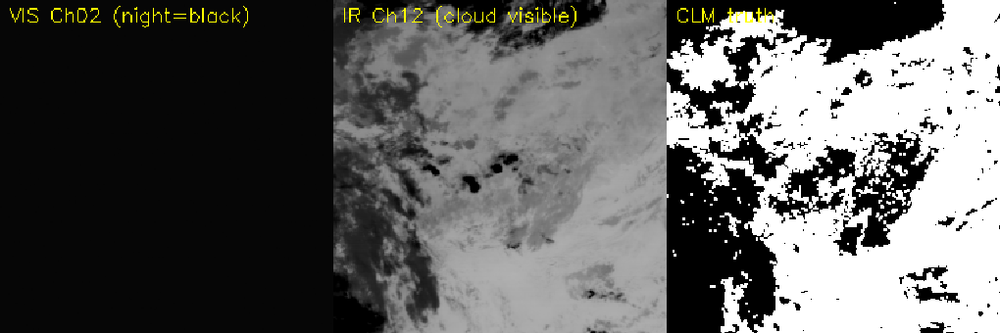
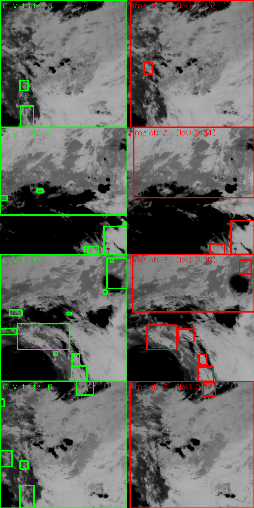
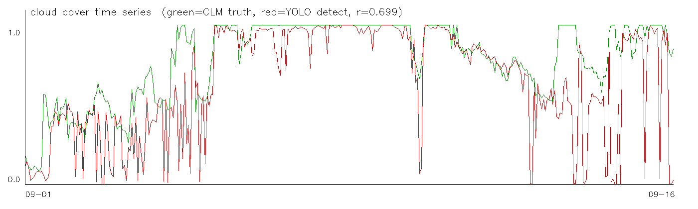
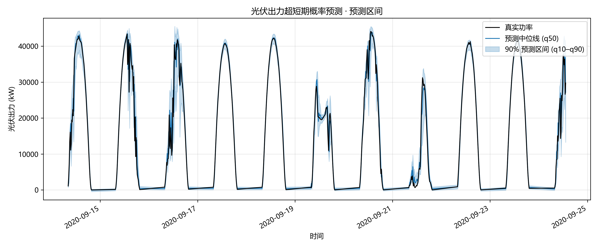
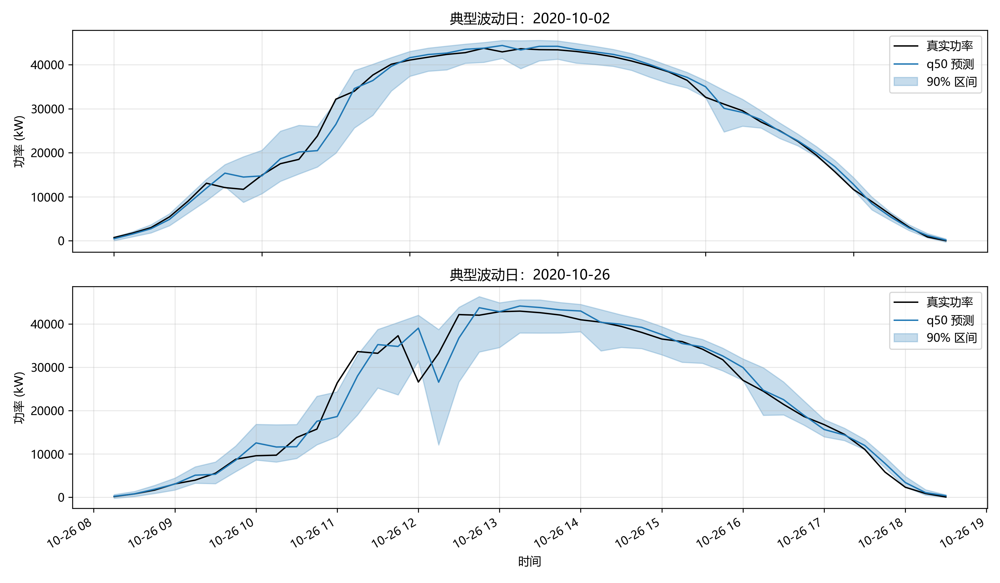
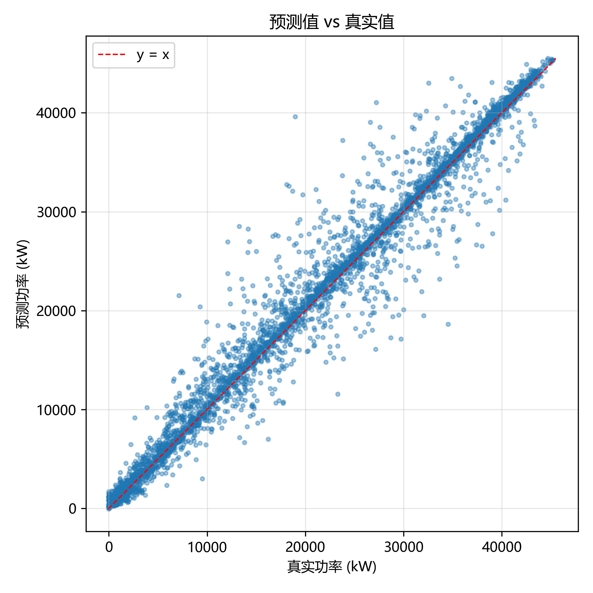
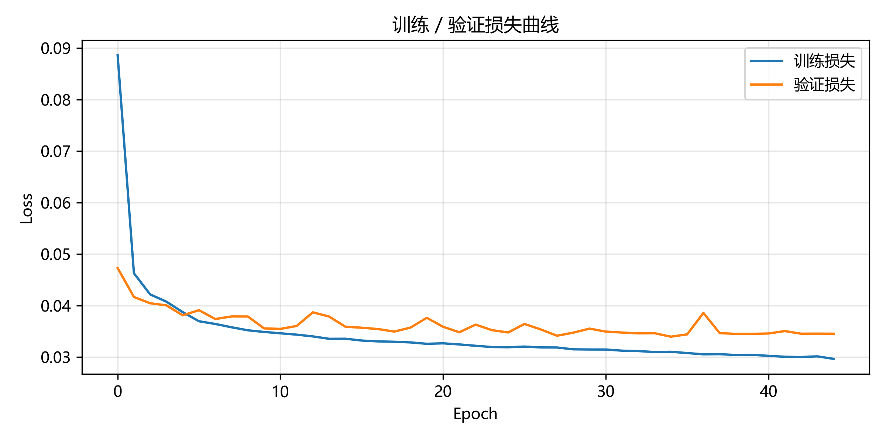

# 光伏出力超短期概率预测（Probabilistic PV Forecasting）

用一个 LSTM 骨干网络，输出**未来 15 分钟光伏出力的概率分布（预测区间）**，而不是单一预测值，并给出标准化的区间评价指标（PICP / PINAW）与可视化结果。

> 本项目定位为「分布鲁棒优化」下游应用的**预测模块**：概率输出可直接作为微电网调度中模糊集（不确定集）构造的输入。核心价值不在单点精度，而在"给出可量化的不确定性"。

---

## 技术链路

```
                    ┌─ 数值底座：公开光伏数据 → LSTM 点预测 → 分位数回归 LSTM（概率预测）→ 预测区间 ─┐
                    │                                                                           ↓
 （视觉 × 能源交叉）─┤                                                         [下游：模糊集 → 分布鲁棒优化]
                    │                                                                           ↑
                    └─ 视觉前兆：风云四号云图 → YOLO 云团检测 → 云量时间序列 → CLOUD_COVER 特征 ────┘
```

---

## 目录结构

```
project/
├── README.md              # 本文件
├── requirements.txt
├── config.py              # 所有超参集中管理（数据/模型/训练）
├── data/
│   ├── download_data.py   # 下载指引 / 合成数据生成（容错兜底）
│   ├── preprocess.py      # 清洗、特征工程、滑窗、时间切分、归一化
│   └── merge_cloud.py     # 云量特征对接（视觉模块 → 预测）
├── models/
│   ├── lstm_point.py      # 点预测模型（阶段 1 基线）
│   ├── lstm_quantile.py   # 分位数回归模型（阶段 2 核心）
│   └── losses.py          # pinball loss / 高斯 NLL
├── train.py               # 训练入口（--mode point / quantile）
├── evaluate.py            # 计算 RMSE / MAE / nRMSE / PICP / PINAW / CRPS
├── visualize.py           # 出图（300 dpi）
├── vision/                # 视觉模块：卫星云图 → 云团检测 → 云量，见 vision/README.md
│   ├── download_batch.py  # NSMC 风云四号 L1/CLM 批量下载（含 429 限流重试）
│   ├── extract_l1_images.py # L1 HDF → 图像
│   ├── crop_region.py     # 红外 Ch12 广东沿海裁剪（地理投影定位）
│   ├── clm_to_yolo.py     # CLM 官方云掩膜 → YOLO 标注数据集
│   ├── yolo_cloud_series.py # YOLO 检测 → 云量时间序列 CSV
│   ├── predict_all_val.py # 检测结果可视化（真值 vs 预测）
│   ├── cloud_detect.py    # 颜色阈值法云检测（无监督基线）
│   └── unet.py / train_seg.py # U-Net 云分割（可选）
├── docs/
│   ├── 运行指南.md         # 从零开始的完整命令序列
│   └── 原理说明.md         # 通俗解释：为什么概率预测、pinball、PICP/PINAW、DRO 衔接
└── results/
    ├── figures/           # PNG 图
    ├── checkpoints/       # 模型权重
    ├── metrics_*.json     # 指标存档
    └── ...
```

---

## 快速开始

```bash
# 1) 装依赖
pip install -r requirements.txt

# 2) 无真实数据时，先用合成数据跑通全流程
python train.py --mode quantile --synthetic
python evaluate.py --mode quantile --synthetic
python visualize.py --mode quantile

# 3) 有点预测基线（可选）
python train.py --mode point --synthetic
python evaluate.py --mode point --synthetic
python visualize.py --mode point
```

真实数据已下载好时，去掉 `--synthetic` 直接运行即可（`DATA_SOURCE` 已默认为 `"state_grid"`）。程序会自动检测到新数据并重建预处理缓存。

---

## 数据

支持三种数据源（`config.py` 的 `DATA_SOURCE` 切换，或加 `--synthetic`）：

**① 国家电网新能源预测竞赛数据集（推荐，默认启用）**
中国国家电网 2021 年新能源预测竞赛数据，发表于 Nature 旗下《Scientific Data》，CC BY 4.0 可引用。8 个光伏电站，2019–2020 两年、15 分钟采样。列含：Power(MW)、总辐照度、GHI、DNI、环境温度、相对湿度、大气压力。

```bash
# GitHub 镜像下载（国内可直连；figshare 官方出处部分网络会 403）：
curl -L -o data/raw/solar_station_1.xlsx \
  "https://raw.githubusercontent.com/Bob05757/Renewable-energy-generation-input-feature-variables-analysis/main/data_original/solar_stations/Solar%20station%20site%201%20(Nominal%20capacity-50MW).xlsx"
# config.py 已默认 DATA_SOURCE = "state_grid"，直接运行即可
```

**② Kaggle Solar Power Generation Data（备选）**
两个印度光伏电站 34 天、15 分钟数据，含 4 个 CSV（每站的生成数据与气象数据）。

```bash
kaggle datasets download -d anikannal/solarpowergeneration -p data/raw --unzip
```

**③ 合成数据（兜底，无需联网）**：加 `--synthetic` 自动生成，保证全流程可跑通。

> 为什么推荐国家电网数据：国内直连（GitHub 镜像）、数据量多约 20 倍（两年 vs 34 天）、且是中国真实电站，更贴合"海岛微网"这一应用背景，还能在汇报中引用《Scientific Data》出处。

**容错设计**：脚本启动时检查数据是否存在；不存在则打印下载指引，并可用 `--synthetic` 自动生成一份结构一致的合成数据（钟形辐照度曲线 + 云团随机遮挡 + 噪声），保证全流程可跑通、可演示。

**数据预处理要点**：
- 按 `SOURCE_KEY`（逆变器）聚合到电站级（功率求和、气象取均值）；
- 补全等间隔时间轴、线性插值填缺失、负值归零、突刺截断；
- 时间特征用小时/分钟的正余弦周期编码（避免 23:59 → 00:00 跳变）；
- **按时间顺序切分**（70% 训练 / 15% 验证 / 15% 测试），严禁随机打乱；
- **归一化只在训练集上 fit**，再 transform 验证/测试集，杜绝数据泄漏；
- 夜间样本处理策略：默认 `DAYTIME_ONLY=True`，只对白天目标时刻训练与评估（夜间功率≈0，无预测价值且会虚高覆盖率）。

---

## 方法

**阶段 1 · 点预测基线**：2 层 LSTM/GRU，hidden 64，输入过去 96 步（24h），输出未来 H 步（默认 1 步 = 15min），MSE 训练。用于打底、对照。

**阶段 2 · 概率预测（核心）**：与点预测共用同一骨干网络，仅把输出层改为同时输出 3 个分位数 `q = [0.1, 0.5, 0.9]`，用 **Pinball Loss（分位数损失）** 训练。三条线合起来就构成一个 90% 预测区间。

**为什么用分位数回归**：它不假设功率服从某个特定分布（光伏出力因云团遮挡高度非高斯、非对称），而是直接学习不同分位点，训练稳定、实现简单、解释直观，是最适合本场景的概率预测入门方法。

---

## 结果

> 以下为**国家电网真实数据**（站点 1，标称 50 MW，2019–2020 两年、15 分钟采样，测试集 4400 个白天样本）的结果。

| 模型 | RMSE (MW) | MAE (MW) | nRMSE | PICP (90%) | PINAW |
|---|---|---|---|---|---|
| 点预测 LSTM | 2.289 | 1.299 | 0.0506 | — | — |
| 分位数回归 LSTM（q50，11 分位数） | 2.259 | 1.240 | 0.0500 | **0.8668** | **0.1114** |

> 目标为 50 MW 光伏站，RMSE ≈ 2.26 MW ≈ 容量的 4.5%。对"仅用本地气象、15 分钟超短期、无数值天气预报（NWP）"的设定，这是合理水平；加入 NWP 或云图后可进一步降低。数据已含清洗（湿度异常剔除）。

**指标怎么读**：
- **PICP = 区间覆盖率**：标称 90% 的区间实际覆盖 **86.7%**，已很接近标称——比 3 分位数时的 81.0% 明显改善：更多分位数让模型能更准确地刻画 q05/q95 尾部。
- **PINAW = 归一化区间宽度**：0.111，平均区间宽度约为目标极差的 11%，松紧适中。比之前的 8.3% 略宽，这是"覆盖够"的必要代价（之前的 81% 覆盖其实是区间过窄、过自信）。
- 两者一起看：PICP 接近标称且 PINAW 合理 = 又准又紧；PICP 明显偏低 = 区间太窄不可全信；PICP 很高但 PINAW 很大 = 区间太宽、无信息量。

### 视觉云检测（前兆信号）

本地辐照度只能反映"已经压在电站头顶的云"；卫星云量能提前看到"还没飘到电站上空的云"，是光伏爬坡/骤降的**前兆信号**。视觉模块用风云四号 B 星（FY-4B）卫星数据训练了云团检测模型：

| 云团检测（YOLOv5s，红外 Ch12）| 结果 |
|---|---|
| mAP50 / mAP50-95 | 0.196 / 0.084 |
| 训练数据 | 346 时次（FY-4B L1 FDI + L2 CLM，广东沿海 256×256 裁剪）|
| 云量序列 vs CLM 官方真值 | 相关系数 0.699 |

> 关键设计：用**长波红外 12μm 通道**而非可见光——可见光夜间全黑（近一半时次无信号），红外全天候可见云。云量序列已存为 `vision/output/cloud_cover_yolo.csv`，可被 `merge_cloud.load_cloud_series` 直接读入作为 `CLOUD_COVER` 特征。

**① 为什么用红外**：可见光夜间全黑（近一半时次无信号，却仍被 CLM 标了云，污染训练），红外 12μm 靠「云顶温度低」全天候可见云。同一夜间时刻，可见光亮度 6.0（纯黑）vs 红外 114.8（有云）：



**② 检测效果**：绿框 = CLM 官方真值，红框 = 模型预测（mAP50 0.196）：



> 当前 mAP50 0.196 的水平意味着：大云团能框住、框定位大致正确，但**小云团 / 碎云漏检较多、框大小有偏差**。这是 **4km 分辨率下小目标 + 数据量仍在扩充** 的固有短板——继续加数据或换更大模型（如 yolov5l）可进一步改善。

**③ 云量时间序列**（09-01 ~ 09-16，红 = YOLO 检测，绿 = CLM 真值，r = 0.699）：云量从 20% 一路波动到 100%，完整捕捉了「晴 → 阴 → 晴 → 阴」的演变，这正是光伏出力起伏的前兆节奏。



---

## 关键图

**预测区间图（核心）**：真实功率曲线 + q50 中位线 + q10–q90 半透明区间带。



**典型波动日放大图**：挑波动最剧烈（有云团遮挡）的日子放大，突出"不确定性大时区间自动变宽"。



**预测值 vs 真实值散点图**：



**训练损失曲线**：



---

## 运行说明

- **每个阶段可独立运行**：`python train.py --mode point` / `--mode quantile`。
- **所有超参集中在 `config.py`**：改窗口长度、分位数、隐藏层大小、训练轮数等，只改这一处。
- **固定随机种子**（`config.SEED=42`），保证结果可复现。
- **CPU 即可运行**（自动检测 GPU，有则用）。完整命令序列见 [`docs/运行指南.md`](docs/运行指南.md)。

---

## 参考

- 分位数回归：Koenker & Bassett (1978)
- 概率预测区间评价：PICP / PINAW（见 Khosravi et al. 系列综述）
- DeepAR：Salinas et al. (2019)（本项目 `losses.py` 预留了高斯 NLL 作为可选进阶）
